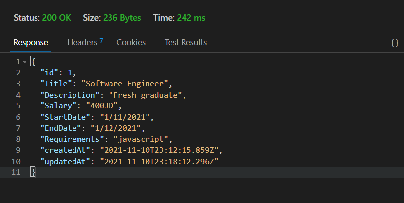

# auth-api-project

## install

1. copy the link of the repo
1. clone the repo on your local machine by `git clone repo-url`
1. download independencies by `npm i`
1. create a `.env`, then cope the content of `.env.sample` file inside the `.env` file.
1. fill the variables of `.env`
1. run the app

### Setup

#### `.env` requirement

- `PORT` - port number
- `DATABASE_URL` - postgres://localhost:5432/dbName
- `SECRET` - a random secret for encryption

#### Running the app

- either:

  1. `npm start`
  1. `nodemon`

- through `postman` or `thunder client`

- **Sign Up**: `http://localhost:5555/signup`

  - send an `json` object as follow:

    

  - returns user Object as saved in DB

    

- **Sign In**: `http://localhost:3001/signin`

  - send in headers username and password as follow :  
    

  - returns Object

    

-

- **/users endpoint**: `http://localhost:3001/users`

  - send bearer authentications as follow:
    

  - return an array of users
    

#### Jobs endpoints

- **GET All**: `http://localhost:3001/api/v1/jobs`

  - send a get request and return an array as follow:  
    

- **GET BY ID** : `http://localhost:3001/api/v1/jobs/:<_id>`

  - send a get request with a bearer authentication as follow:  
    

  - return an object  
    

- **POST** : `http://localhost:3001/api/v1/jobs`

  - send a post request as follow:  
    
  - return an object  
    

- **PUT**: `http://localhost:3001/api/v1/jobs/:<_id>`

  - send a put request as follow:  
    
  - returns the updated object  
    

- **DELETE** : `http://localhost:3001/api/v1/jobs/:<_id>`
  - send a delete request as follow:  
    

#### Test

- Unit test: `npm run test`
- Lint test: `npm run lint`

### UML:

### Deployed link on Herouku:
- https://job-post-401.herokuapp.com/ 
